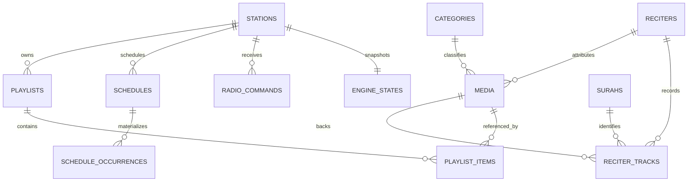
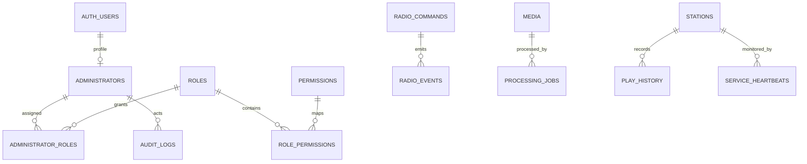

# 02 — Database ERD & PostgreSQL Design

## 1. مبادئ النمذجة

- UUID للكيانات التشغيلية؛ `smallint` للسور الثابتة.
- `timestamptz` لكل لحظة فعلية، و`date` + `time` + IANA timezone لتعريف نية الجدولة المحلية.
- soft delete للمحتوى القابل للأرشفة؛ لا soft delete لسجلات audit/history.
- كل target تشغيلي مرتبط بـ`station_id` حتى في MVP.
- Queue/now-playing عبارة عن projections قابلة لإعادة البناء؛ commands/occurrences/events هي ledger.
- لا يدخل Media إلى schedule/playlist الفعلي إلا إذا كان `READY`؛ يفرض ذلك service validation وtransactional functions، لأن CHECK لا يستطيع قراءة صف أجنبي بأمان.

## 2. ERD

## 3. Aggregate ownership

| Aggregate | الجداول | invariant الأهم |
|---|---|---|
| Identity | administrators/roles/permissions/maps | Auth user فعال + permission backend-side |
| Catalog | media/categories/reciters/surahs/tracks | المحتوى المنشور صالح وغير مؤرشف |
| Station | stations/playlists/items/programs | default playlist تنتمي للمحطة وفعالة |
| Scheduling | schedules/templates/occurrences | occurrence unique ولا يُنفذ مرتين |
| Automation | commands/events/state/queue/lease/history | leader واحد وfencing token صالح |
| Operations | heartbeats/logs/audit/metrics | append-only + retention |

## 4. تصميم الجدولة الزمنية

السجل يحتفظ بـ:

- `start_date`, `end_date`, `start_time`: النية المحلية.
- `timezone`: snapshot IANA عند إنشاء schedule؛ تغيير timezone المحطة لا يعيد تفسير القديم تلقائيًا.
- `next_run_at`: قيمة UTC مشتقة للتسريع وليست مصدر الحقيقة.
- `schedule_occurrences.scheduled_for`: اللحظة UTC المحسوبة.
- `occurrence_key`: hash منطقي من `(schedule_id, local_date, local_time, timezone, fold)`.

سياسة DST: وقت غير موجود بسبب spring-forward ينتقل لأول لحظة صالحة بعد الفجوة ويسجل `DST_SHIFTED`. الوقت المكرر في fall-back يستخدم أول occurrence افتراضيًا (`fold=0`) ولا يتكرر إلا بسياسة صريحة مستقبلًا.

## 5. الفهارس والتقسيم

- due schedules: partial index على `(next_run_at, priority)` حيث enabled وغير محذوف.
- commands: partial index على `(station_id, priority desc, created_at)` حيث `PENDING`.
- media search: `pg_trgm` على normalized Arabic/English fields في migration لاحقة، وB-tree للفلاتر.
- `radio_events`, `play_history`, `system_logs`, metrics مرشحة للتقسيم الشهري عند بلوغ الحجم، وليس قبل القياس.
- جميع foreign keys ذات مسارات الحذف المقصودة: RESTRICT للمحتوى التاريخي، CASCADE لجداول الربط فقط.

## 6. Supabase exposure model

- `app` و`radio` غير مضافين إلى exposed schemas.
- `api` يحوي security-invoker views/RPCs عامة محدودة فقط، أو يخدم REST service قاعدة البيانات مباشرة دون Data API.
- RLS مفعّل defense-in-depth؛ لا grants إلى `anon/authenticated` إلا بشكل صريح.
- `service_role` لا يصل إلى المتصفح مطلقًا؛ API/workers تستخدم أسرار server-side.
- لا تعديل مباشر لجداول `storage`؛ كل object mutation عبر Storage API.

## 7. البدائل

- **Enums مقابل lookup tables:** enums مناسبة للحالات الثابتة؛ permissions lookup table لأنها تتوسع. أي enum جديد migration صريح.
- **pg_cron للScheduler:** مرفوض كمحرك playout؛ يصلح housekeeping فقط. scheduler يحتاج state/queue/ACK.
- **Realtime commands:** يمكن استخدامه كـwake-up optimization، لكن polling/claim هو correctness path حتى لا يصبح فقد event سببًا لفقد command.

## 8. Dependencies والمخاطر

- مرجع `auth.users` يجعل الاختبارات المحلية تحتاج Supabase stack أو fixture schema متوافقًا.
- cyclic default playlist FK يضاف بعد إنشاء الجدولين.
- JSONB payloads تحتاج JSON Schema في API؛ قاعدة البيانات تفرض الشكل الأساسي فقط.
- تعديل role قد لا ينعكس فورًا في JWT؛ authorization الحساس يقرأ DB أو يجبر refresh/revoke.

## 9. Acceptance Criteria

- DDL يمر على PostgreSQL/Supabase محلي في المرحلة الثانية دون FK ordering errors.
- كل جدول مطلوب في Master Prompt موجود أو موثق كبديل.
- لا يوجد schedule occurrence بلا مفتاح unique.
- لا يوجد command بلا station/idempotency/audit status.
- ERD يدعم محطة ثانية دون migration بنيوي.
- RLS/grants tests جزء إلزامي من migration phase.
