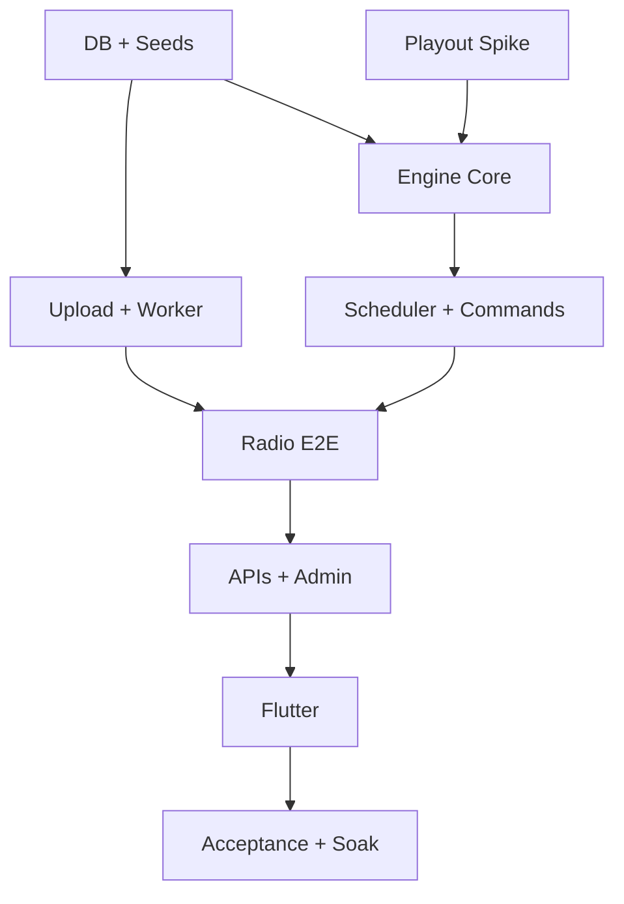

# 07 — MVP Backlog & Implementation Plan

## 1. Definition of Done لكل خطوة

`Plan → Implement → Test → Verify → Document → Commit-ready`. لا تنتقل الخطوة إذا فشل مسارها الأساسي. لا تُقبل mock لخدمات DB/FFmpeg/Icecast/Engine في integration path؛ يمكن fakes فقط في unit tests للـpure logic.

## 2. مراحل التنفيذ الصغيرة المرتبة

### Gate 0 — اعتماد Technical Design (هذه المرحلة)

- اعتماد القرارات المفتوحة في README.
- مراجعة DDL/ERD/state/algorithms/security/topology.
- تسجيل القرارات كـADRs.
- **قبول:** checklist آخر هذا الملف مكتملة؛ لا runtime code.

### 1 — Repository & Local Toolchain

- تثبيت Node/Flutter/Supabase CLI/FFmpeg/Icecast/container versions.
- workspace/package manager، lint/format/test skeleton، env examples بلا secrets.
- CI أولي وdocs commands.
- **اختبار مستقل:** clean clone يشغل checks وSupabase local.

### 2 — Database Migrations & Seeds

- تحويل proposed DDL إلى migrations صغيرة مرتبة.
- roles/permissions seed، 114 surahs verified seed، محطة development واحدة.
- grants/RLS، constraints، indexes، updated_at، database tests.
- **اختبار:** migrate from zero + reset + seed count=114 + forbidden access tests + advisors clean.

### 3 — Storage & Upload Intent

- buckets/policies، upload intent/complete، MIME/signature/size guard، cleanup quarantine.
- Media lifecycle فقط حتى `PROCESSING`.
- **اختبار:** valid upload stored privately؛ spoofed/oversized rejected؛ retry idempotent.

### 4 — Audio Processing Worker

- claim/heartbeat/recovery، ffprobe validation، two-pass normalization، encode/verify/store.
- READY/FAILED transitions وprocessing metrics.
- **اختبار حقيقي:** MP3/AAC/M4A/WAV fixtures → verified output؛ corrupt file fails safely.

### 5 — Icecast + Continuous Playout Spike

- local Icecast/Nginx، playout adapter candidate، fixed mount، metadata.
- مقارنة Liquidsoap/custom FFmpeg بناءً على gap waveform وrecovery لا التفضيل النظري.
- **اختبار:** 6h loop، 500 track switches، forced decoder/source crash، هاتفان/clients في اللحظة نفسها.
- **Gate:** اعتماد playout technology قبل Engine integration.

### 6 — Radio Domain Core

- pure state machine، candidate model، priority arbiter، queue lanes، deterministic shuffle.
- property/unit tests لكل transitions/ties.
- **اختبار:** كل سيناريوهات Radio Engine المذكورة في Master Prompt دون I/O.

### 7 — Leader Lease & Checkpoints

- per-station lease/fencing، engine/queue snapshots، local emergency cache.
- **اختبار:** workerان يتنافسان؛ واحد فقط يصدر effects؛ network partition يرفض token القديم.

### 8 — Scheduler

- occurrence materialization، one-time/daily/weekly، DST، preview، edit/version، conflicts.
- **اختبار:** timezone matrix + restart + midnight + duplicate ticks + 1000 definitions.

### 9 — Commands & Queue Integration

- PLAY_NOW/PLAY_NEXT/SKIP/STOP_AFTER_CURRENT/RESUME_AUTO؛ claim/reconcile/audit.
- **اختبار:** retry/crash at every boundary لا يكرر effect؛ policies الثلاث صحيحة.

### 10 — End-to-End Radio Engine

- Engine ↔ playout ↔ Icecast، Now Playing ACK، history، default/emergency recovery.
- **اختبار:** upload→process→playlist→default→schedule→commands→listen الحقيقي.

### 11 — Watchdog & Observability

- structured logs/metrics/dashboards/alerts، process/external audio probes، restart budget.
- **اختبار:** kill Engine/decoder/encoder/Icecast، DB outage، disk threshold؛ تحقق resume/alert/no storm.

### 12 — Public & Admin REST API

- OpenAPI 3.1، public catalogs/now/config، admin CRUD/commands/health، RBAC/idempotency/cache.
- **اختبار:** contract/security/rate-limit/pagination/stale-cache tests.

### 13 — Admin Panel

- auth، dashboard، media، playlist، schedule day/week/list+forms، commands، health.
- accessible forms وعدم الاعتماد على drag/drop.
- **اختبار:** critical browser E2E من mobile/tablet/desktop viewports.

### 14 — Flutter Core (بعد استقرار backend فقط)

- feature architecture، networking/cache، live background service، on-demand session، favorites/search/settings.
- **اختبار:** Android/iOS background/lock-screen/headphones/focus/retry/fallback/sleep timer؛ no seek live.

### 15 — Acceptance, Staging & Reliability

- Master 22-step acceptance scenario، load/API/listeners، 72h soak، backup restore، security review، rollback drill.
- **قبول:** لا silent gap يتجاوز الهدف، no duplicate command، recovery meets RTO، runbooks proven.

### 16 — Production Preparation

- domains/TLS/secrets/HA choice/capacity/alerts/on-call/store privacy artifacts.
- production readiness review؛ لا deploy قبل sign-off.

## 3. Dependencies الحرجة

## 4. Acceptance Criteria للمرحلة الأولى

- [x] تحليل live/on-demand/admin ومتطلبات الجودة والنطاق.
- [x] معمارية نهائية ومسؤوليات وحدود اتساق.
- [x] ERD وDDL مرجعي متعدد المحطات.
- [x] State Machine وانتقالات/recovery/checkpoint.
- [x] Scheduler timezone-aware وoccurrence idempotency.
- [x] Queue/priority/conflict/commands محددة deterministic.
- [x] Never Silence/fallback متعدد الطبقات.
- [x] Storage/FFmpeg/Icecast وتصميم فصل on-demand.
- [x] Public/Admin API contract.
- [x] Auth/RBAC/RLS/security model.
- [x] Monitoring/watchdog/backup/deployment/monorepo.
- [x] مراجعة race/SPOF/timezone/gaps/duplication/scaling.
- [ ] اعتماد المالك للقرارات المفتوحة.
- [ ] اعتماد Acceptance targets: gap/SLO/RPO/RTO/retention.

## 5. Checklist الانتقال إلى المرحلة الثانية

- [ ] اختيار playout adapter: Liquidsoap أو custom persistent FFmpeg.
- [ ] تحديد timezone وregion للمحطة الأولى.
- [ ] اعتماد audio profile بعد listening samples أو السماح بSpike يقارن profiles.
- [ ] اعتماد storage provider للـMVP وسياسة backup/egress.
- [ ] اعتماد production topology: single-host risk مؤقتًا أو dual Icecast.
- [ ] اعتماد default interrupt policy وlate grace.
- [ ] اعتماد data retention وprivacy notice scope.
- [ ] تثبيت ADRs من القرارات السابقة.
- [ ] مراجعة اسم المنتج/domains placeholders؛ لا يلزم DNS الآن.
- [ ] تصريح صريح: **ابدأ المرحلة الثانية — Repository & Database Foundation**.

بعد اكتمال القائمة تكون أول نتيجة للمرحلة الثانية: repo tooling + migrations/seeds محلية قابلة لإعادة الإنشاء. لا تبدأ Upload/FFmpeg قبل نجاح database reset/security tests.
