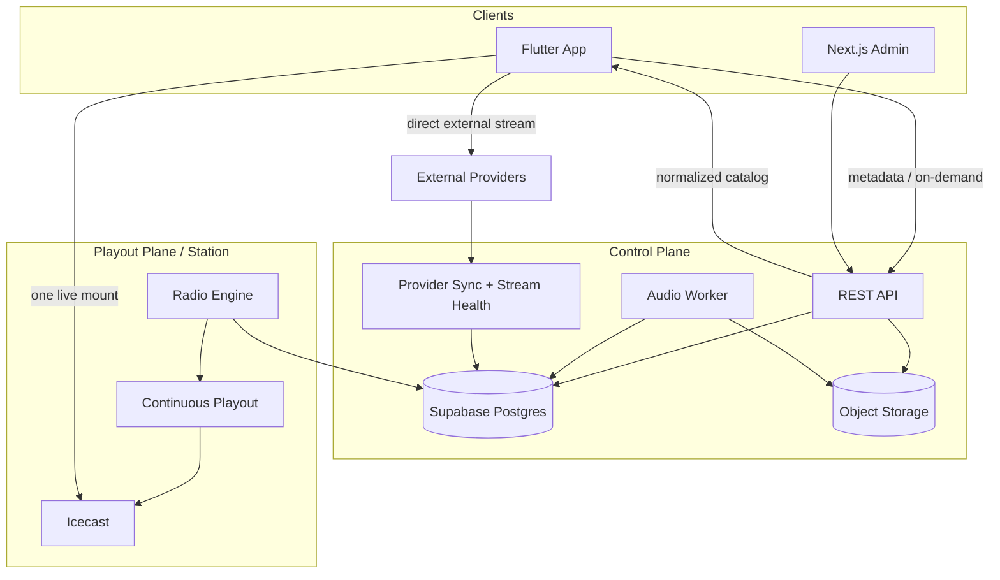

# System Architecture

> الاسم الرسمي للمشروع: **ترتيل (Tarteel)**، والمعرّف التقني الموحد: `tarteel`.

## 1. تحليل المتطلبات وحدود النظام

المنصة ثلاثة منتجات تشترك في البيانات ولا تشترك في مسار الصوت:

- **Live Radio:** بث خطي مستمر؛ كل مستمع عند اللحظة نفسها؛ لا seek.
- **On-Demand Quran:** ملفات مستقلة قابلة للـseek والـqueue والسرعة والاستئناف.
- **Administration:** إدارة المحتوى والجدولة والأوامر والصلاحيات والمراقبة.

متطلبات الجودة الحاكمة: بث 24/7، deterministic scheduling، تنفيذ command مرة واحدة فعليًا، استعادة بعد crash، عدم ربط استمرار الصوت بتوفر لوحة الإدارة، دعم محطة واحدة الآن وعدة محطات لاحقًا، وأقل جمع ممكن للبيانات الشخصية.

### 1.1 المتطلبات الوظيفية المستخرجة

| المجال | المتطلبات الملزمة للـMVP |
|---|---|
| Live Radio | محطة 24/7، mount ثابت، كل المستمعين في اللحظة نفسها، Now Playing، primary/fallback stream |
| External Radio | provider catalog، adapters/sync، direct playback، protocol health، fallback، rights/production gate |
| Media | upload، validation، حالات UPLOADING/PROCESSING/READY/FAILED، معالجة مرة واحدة، preview/archive/search/filter |
| Automation | default playlist، playlists مرتبة، ONE_TIME/DAILY/WEEKLY، Play Now/Next/Interrupt، Skip، Resume Auto |
| Catalog | readers، 114 surahs seed، reciter tracks، categories، بحث عربي/إنجليزي |
| On-Demand | seek، queue، next/previous، repeat، speed، resume، background playback؛ منفصل عن live |
| Administration | Supabase Auth، RBAC، dashboard، media/schedule/playlist/station management، audit |
| Mobile | Android/iOS، just_audio/audio_service، background/lock screen/headset/audio focus، mini player، sleep timer، local favorites/cache |
| Operations | health، metrics، logs، watchdog، backups/restore، staging/production separation |
| Extensibility | station_id في كل aggregate تشغيلي، seams للـlive input/accounts/downloads دون تنفيذ Phase 2 |

### 1.2 المتطلبات غير الوظيفية

| الصفة | المتطلب/طريقة القياس |
|---|---|
| Availability | Never Silence، استعادة تلقائية، external audio probe؛ SLO النهائي يحتاج اعتمادًا |
| Correctness | deterministic total order، occurrence ledger، idempotent commands، fencing token |
| Durability | PostgreSQL source of truth، immutable objects، PITR/dumps، restore drills |
| Security | HTTPS، least privilege، RLS/grants، upload sandbox، no secrets/log leakage |
| Performance | API pagination/cache، prebuffer next track، bounded DB pools، CDN للـon-demand |
| Resilience | bounded retry/backoff/circuit breaker، local safe queue أثناء dependency outage |
| Scalability | listeners يتوسعون عند Icecast لا API؛ leader مستقل لكل station؛ stateless API/workers |
| Accessibility | Scheduler forms بديل كامل للـdrag/drop، Admin responsive، رسائل خطأ واضحة |
| Privacy | لا حساب للمستمع، favorites محلية، analytics aggregates، لا raw IP ما لم يلزم قانونيًا |
| Maintainability | monorepo modules، typed contracts، migrations، ADRs، tests/runbooks/observability |
| Portability | environment-driven domains/credentials، pinned containers/tools، no hard-coded secrets |

### 1.3 القيود والافتراضات المعلنة

- الـTechnology Stack الملزم محفوظ: Flutter/Dart، Next.js/TypeScript، Supabase/PostgreSQL/Auth/Storage، FFmpeg، Icecast، Ubuntu، Nginx.
- الإضافة المقترحة الوحيدة هي **Liquidsoap كـplayout adapter** لتقليل audio gaps؛ لم تُعتمد بعد، والبديل هو persistent FFmpeg pipeline. FFmpeg يبقى إلزاميًا للـprobe/processing في الحالتين.
- مشروع Supabase الحالي في `ap-northeast-1` وPostgreSQL 17، لكن تصنيفه البيئي لم يُحسم.
- timezone، SLO/RPO/RTO، codec profile، production HA budget قيم غير محسومة ومعلنة، وليست افتراضات مخفية.

### خارج MVP

الميكروفون الحي، Push، downloads، حسابات المستمعين، CarPlay/Android Auto، casting، schedule calendars المتخصصة، والتحليلات المتقدمة. تُحفظ seams لها فقط من دون تنفيذها.

## 2. المعمارية النهائية

### مسار التحكم

1. Admin يصادق عبر Supabase Auth.
2. REST API يتحقق من JWT ثم permission في قاعدة البيانات.
3. تعديلات المحتوى/الجدولة معاملات PostgreSQL.
4. Play Now/Next/Interrupt ينشئ صفًا في `radio.radio_commands` مع idempotency key.
5. Leader المحطة يطالب بالأمر وينفذه ويسجل event/result.

### مسار الصوت

1. الملفات المعالجة فقط تدخل Queue.
2. Engine يختار المصدر وفق الأولوية والسياسة.
3. Render adapter يحافظ على encoder/source connection واحد مستمر.
4. Icecast يوزع البث نفسه على جميع المستمعين؛ لا اتصال file-per-listener.

### مسار المحطات الخارجية

1. Provider Adapter يجلب/يطبع البيانات إلى internal model ويكتب catalog فقط.
2. Stream Health Worker يفحص source فعليًا ويحدث health/history ضمن pool مستقل.
3. Public API يعيد station DTO موحدًا؛ Flutter يتصل بالمصدر الخارجي مباشرة.
4. لا schedule/queue/radio command لمحطة EXTERNAL، ولا external fallback لمسار INTERNAL.
5. فشل Provider API أو كل External Streams لا يملك مسارًا لإسكات Icecast الداخلي.

## 3. مسؤوليات المكونات

| المكون | مسؤولياته | لا يفعله |
|---|---|---|
| Flutter | Live/On-demand playback، cache، favorites، sleep timer | لا يجدول ولا يبث MP3 لكل مستمع |
| Next.js Admin | UI responsive وsession UX | لا يصل إلى FFmpeg أو Queue مباشرة |
| REST API | validation، versioning، RBAC، idempotency، public projections | لا يقوم playout مستمرًا |
| PostgreSQL | source of truth، constraints، leases، audit، occurrence ledger | ليس message bus صوتيًا |
| Storage | original/processed/artwork، signed access | لا يحمل حالة الجدولة |
| Audio Worker | probe/normalize/encode/metadata/checksum | لا يشغّل مادة غير `READY` |
| Provider Adapters | fetch/normalize/compare/sync provider catalogs | لا يكتب radio queue ولا يكشف raw schema لـFlutter |
| Stream Health Worker | bounded protocol-aware probes وhealth history | لا يكتفي HTTP 200 ولا يمرر الصوت للمستمع |
| Scheduler داخل Engine | materialize due occurrences بوقت المحطة | لا يغيّر تعريف schedule |
| Queue Manager | deterministic candidate selection وresume frames | لا يقبل mutation من UI |
| Radio Engine | state/leader/commands/checkpoints/recovery | لا يخدم المستمعين مباشرة |
| Playout adapter | decode/switch/mix/continuous encoder/metadata | لا يقرر أولوية الأعمال |
| Icecast | fan-out، mounts، listener stats | لا يدير schedule |
| Watchdog | process/stream health/restart/escalation | لا يحل conflict scheduling |

## 4. اختيار تقنيات الخدمات

- **API:** TypeScript + Fastify مقترح؛ typed JSON schemas/OpenAPI وسرعة تشغيل جيدة. البديل Next.js Route Handlers يقلل خدمة لكنه يربط Public/Admin API بدورة نشر الواجهة.
- **Workers/Engine:** TypeScript service مناسب لتشارك الأنواع، مع child-process supervision. إن أثبت اختبار soak أن jitter/GC يؤثر في playout، يبقى render adapter منفصلًا ولا يلزم تغيير control logic.
- **Playout:** التوصية Liquidsoap كطبقة playout مصممة للراديو، مع FFmpeg للـprobe/processing. البديل custom long-lived FFmpeg encoder يتغذى PCM؛ يحتاج إثبات gapless/failover أصعب. هذا قرار اعتماد قبل التنفيذ.
- **Supabase:** Managed Postgres/Auth/Storage؛ لا تُستخدم Edge Functions للعمل الدائم.
- **External stations:** direct playback هو default؛ أي proxy يحتاج ADR وrights/capacity approval. Provider-specific code يبقى في adapters داخل Backend.

## 5. حدود الاتساق

- DB transaction يثبت schedule/command، وليس بدء الصوت نفسه.
- التنفيذ **at-least-once claim + idempotent effect**؛ لا يمكن ضمان exactly-once بين DB وعملية صوت خارجية بلا مصالحة.
- كل أثر خارجي يسبقه/يتبعه `radio_event` وحالة command قابلة للمصالحة.
- `now_playing` projection يكتب بعد ACK من playout، لا عند نية التشغيل.

## 6. Dependencies

PostgreSQL 15+، Supabase Auth/Storage، FFmpeg/ffprobe بإصدار pinned، Icecast 2.x pinned، playout adapter pinned، Nginx، container runtime، TLS issuer، وhost persistent volume لملفات emergency/cache.

## 7. المخاطر

- الاعتماد على hosted DB من playout؛ يعالج snapshot/cache ووضع degraded.
- فجوة عند تبديل process؛ يعالج مصدر/encoder مستمر واختبارات waveform.
- نمو history/logs؛ partition/retention.
- drift بين DB وplayout؛ ACK + reconciliation.
- تكلفة egress؛ قياس قبل multi-station.

## 8. Acceptance Criteria

- كل component له owner وحدود واضحة.
- لا يوجد مسار من Admin إلى FFmpeg/Icecast control مباشرة.
- تعطل API لا يوقف Queue الحالية.
- live وon-demand مساران منفصلان موثقًا.
- إضافة محطة لا تتطلب schema جديدًا أو binary مختلفًا.
- كل متطلب Master Prompt مصنف إلى MVP أو Phase 2 أو قيد تشغيلي، ولا يوجد UI implementation في هذه المرحلة.
