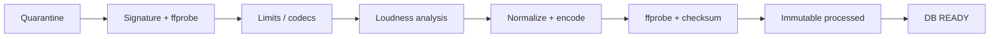
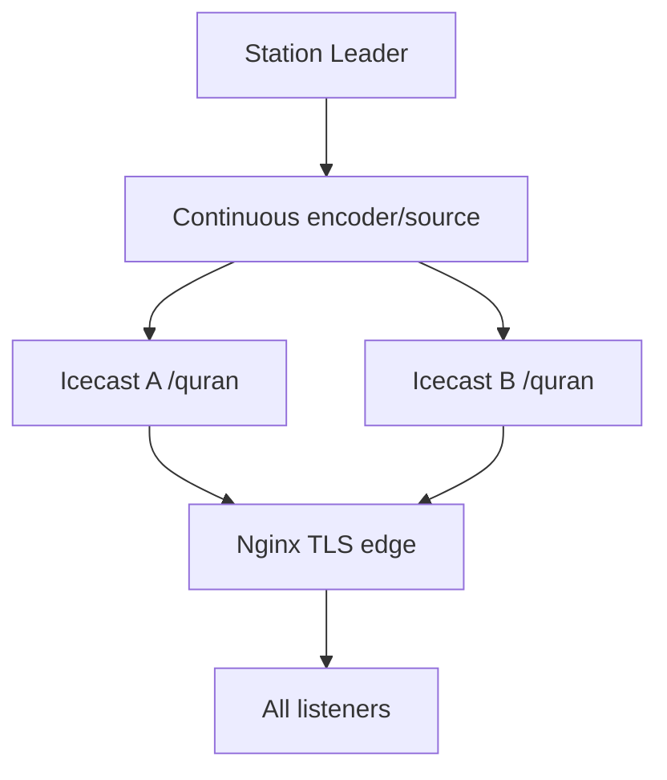

# Storage, Audio Processing & Icecast

## 1. Storage Architecture

| Bucket/prefix | Visibility | Content | Policy |
|---|---|---|---|
| `media-originals` | private | immutable uploaded originals | admin/worker signed access فقط |
| `media-processed` | private في MVP | normalized encoded masters | worker write؛ API signed read / playout service read |
| `public-artwork` | public/CDN | reciter/station images | immutable versioned keys |
| `upload-quarantine` | private | incomplete/unverified uploads | lifecycle delete بعد 24h |
| host `emergency-cache/` | local persistent | verified fallback media | engine read-only، sync job writes atomically |

Object key لا يستخدم filename القادم من المستخدم:

```text
originals/{yyyy}/{mm}/{media_uuid}/{upload_uuid}.bin
processed/{profile_version}/{media_uuid}/{sha256}.{ext}
artwork/{entity}/{uuid}/{content_hash}.{ext}
```

الاسم الأصلي metadata sanitized فقط. DB يخزن object key لا signed URL. URLs تُولد عند الطلب. حذف media هو archive أولًا؛ garbage collector يحذف objects بعد retention وبعد التأكد من عدم وجود references/history policy.

### Upload protocol

1. API ينشئ media `UPLOADING` + upload intent idempotent ومفتاح عشوائي في quarantine.
2. Client يرفع مباشرة إلى Storage ضمن size/content-type constraints.
3. Complete endpoint يتحقق من object size/checksum المتوقع ويقفل intent.
4. Worker يعيد sniff/probe من bytes، لا يثق بـMIME/extension.
5. الأصل ينتقل/ينسخ إلى immutable path، ثم media `PROCESSING`.
6. عند النجاح processed object يُرفع أولًا، يتحقق منه، ثم transaction تقلب `READY`.

عمليات Storage تمر عبر API الرسمية؛ جداول `storage` تعامل read-only. `service_role` server-only. Upsert لا يستخدم للأصول؛ immutable create يقلل تعقيد سياسات insert/select/update.

## 2. FFmpeg Processing Pipeline



### قبول/رفض

- containers المقبولة: MP3, AAC/ADTS, M4A/MP4 audio, WAV؛ whitelist codec فعلية.
- max size وmax duration config server-side؛ قيم أولية مقترحة 2 GiB و12 ساعة وتحتاج اعتمادًا.
- `ffprobe` timeout، resource limits، no network protocols، sanitized environment، worker غير root.
- يرفض video streams، encrypted/unsupported codecs، zero duration، malformed timestamps، path traversal، excessive stream count.
- checksum يمنع معالجة upload نفسه مرتين؛ `idempotency_key=(media_id,input_sha,profile_version)`.

### Processing profile المقترح `radio-aac-v1`

- AAC-LC، 96 kbps، 44.1 kHz، stereo، fragmented/faststart container مناسب حسب on-demand delivery؛ raw ADTS/codec حسب playout adapter.
- EBU R128 two-pass `loudnorm`: target مبدئي `I=-16 LUFS`, `TP=-1.5 dBTP`, `LRA=11`.
- لا trim للصمت تلقائيًا في القرآن؛ الصمت قد يكون مقصودًا. فقط كشف/report للleading/trailing anomalies.
- metadata controlled: title/artist/source IDs؛ إزالة metadata غير لازمة/صور مضمّنة ضخمة.

القيم النهائية profile تحتاج listening test على تلاوات/دروس/أذكار. كل تغيير profile ينشئ version جديدة؛ لا يستبدل master قديمًا بصمت.

### Failure and retry

- transient Storage/network: retry bounded مع jitter.
- deterministic invalid media: `FAILED` فورًا بلا retry آلي.
- process timeout/OOM: retry مرة على worker نظيف، ثم `FAILED/RESOURCE_LIMIT`.
- claim heartbeat وstale-job recovery؛ output key content-addressed يجعل إعادة المحاولة آمنة.
- logs لا تحتوي signed URL أو headers.

### Verification

بعد encode: ffprobe codec/profile/sample rate/channels/duration، duration delta ضمن tolerance، decode أول/وسط/آخر segment، checksum، object HEAD. لا تصبح `READY` قبل النجاح كله.

## 3. Live Radio مقابل On-Demand

| خاصية | Live | On-Demand |
|---|---|---|
| Delivery | Icecast mount | HTTPS object/CDN |
| الزمن | لحظة مشتركة | جلسة مستقلة لكل مستخدم |
| Seek/Range | لا | نعم |
| URL | ثابت للمحطة | per track/version |
| metadata | Now Playing + ICY | API/file metadata |
| failover | stream endpoint policy | retry/signed URL refresh |

لا يستخدم Flutter processed object لتقليد live، ولا يمر on-demand عبر Icecast.

### External streams

External stations لا تدخل upload/normalization/processed storage ولا تعاد ترميزها. Flutter يتصل بالـprimary/fallback الخارجي مباشرة حسب normalized API contract. Stream Health Worker فقط يقرأ sample bounded ويفك frames قصيرة داخل sandbox لإثبات النوع/الصوت؛ لا يحفظ أو يعيد توزيع المحتوى. HLS يفحص playlist/variant/segment منفصلًا، وتوجد device tests Android/iOS لأن sample الحالي يجمع video H.264 وصوت AAC.

## 4. Icecast Architecture



### Mounts and URLs

- public: `https://radio.example.com/quran` (Nginx maps إلى Icecast mount داخلي مثل `/quran.aac`).
- fallback explicit: `https://radio-fallback.example.com/quran` لسياسة تطبيق واضحة إن فشل edge الأساسي.
- source/admin ports خاصة على private network؛ public GET mount فقط.
- TLS ينتهي عند Nginx؛ Icecast داخلي. Security headers وtimeouts مخصصة streaming (لا proxy buffering).

### استمرارية المصدر

Engine لا يبدأ FFmpeg جديدًا متصلًا بـIcecast لكل track. playout adapter يحافظ على continuous encoder/source ويبدّل decoders داخله. metadata update منفصل ولا يقطع stream. Icecast burst/queue sizes تضبط بقياس latency والذاكرة.

### HA options

- **MVP منخفض التكلفة:** Icecast واحد + fallback stream URL خارجي/host ثاني؛ يبقى host SPoF موثقًا.
- **Production موصى به:** بث source نفسه إلى Icecast A/B في منطقتي فشل، health-aware edge/DNS، واختبار failover. هذا يزيل Icecast الواحد كـSPOF لكنه يزيد bandwidth والتشغيل.
- لا يتم failback إلى primary فور عودته: يحتاج 5 دقائق health stable ويفضل switch عند reconnect/track boundary لتجنب flapping.

### Listener metadata/analytics

Icecast admin stats تسحبها collector داخلي ببيانات اعتماد خاصة. نخزن aggregates/session pseudonymous عند الحاجة فقط؛ لا نخزن raw IP. Current/peak من stats، وNow Playing من Engine لأنه المصدر الأدق لقرار playout.

## 5. Dependencies / Risks

- AAC container/mount compatibility تختلف بين clients؛ يلزم device matrix قبل اعتماد profile.
- two-pass normalization يضاعف وقت CPU؛ queue sizing/worker autoscaling بالقياس.
- Supabase Storage egress للبث لا ينطبق على listener live، لكنه ينطبق على Engine downloads وon-demand.
- dual Icecast source output يحتاج إثبات أن timestamps/latency مقبولة.
- local emergency cache يحتاج disk monitoring وatomic refresh.

## 6. Acceptance Criteria

- ملفات MP3/AAC/M4A/WAV صالحة تصبح READY بنسخة واحدة versioned.
- ملف متنكر/تالف لا يصل READY، وسبب الفشل آمن وواضح.
- إعادة job لا تنشئ output مختلفًا أو صفًا مكررًا.
- On-demand يدعم HTTP Range، وlive لا يظهر seek.
- هاتفان يدخلان mount في وقتين مختلفين يسمعان اللحظة نفسها ضمن فرق buffering المتوقع.
- تبديل track/fallback يقاس waveform ولا يسقط source connection.
