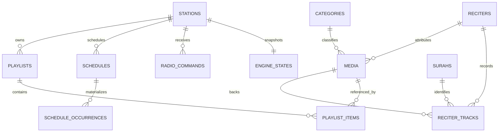
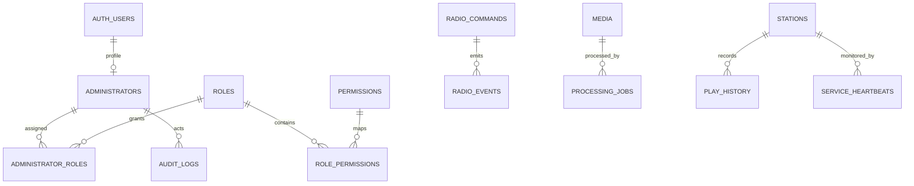

# Database ERD & PostgreSQL Design

## 1. مبادئ النمذجة

- UUID للكيانات التشغيلية؛ `smallint` للسور الثابتة.
- `timestamptz` لكل لحظة فعلية، و`date` + `time` + IANA timezone لتعريف نية الجدولة المحلية.
- soft delete للمحتوى القابل للأرشفة؛ لا soft delete لسجلات audit/history.
- كل target تشغيلي مرتبط بـ`station_id` حتى في MVP.
- Queue/now-playing عبارة عن projections قابلة لإعادة البناء؛ commands/occurrences/events هي ledger.
- لا يدخل Media إلى schedule/playlist الفعلي إلا إذا كان `READY`؛ يفرض ذلك service validation وtransactional functions، لأن CHECK لا يستطيع قراءة صف أجنبي بأمان.

## 2. ERD

## 3. Aggregate ownership

| Aggregate | الجداول | invariant الأهم |
|---|---|---|
| Identity | administrators/roles/permissions/maps | Auth user فعال + permission backend-side |
| Catalog | media/categories/reciters/surahs/tracks | المحتوى المنشور صالح وغير مؤرشف |
| Station | stations/playlists/items/programs | default playlist تنتمي للمحطة وفعالة |
| Scheduling | schedules/templates/occurrences | occurrence unique ولا يُنفذ مرتين |
| Automation | commands/events/state/queue/lease/history | leader واحد وfencing token صالح |
| Operations | heartbeats/logs/audit/metrics | append-only + retention |

### 3.1 Table catalog والعلاقات الحاكمة

| Table | العلاقات الأساسية | Constraints/Indexes الحاكمة |
|---|---|---|
| `administrators` | PK/FK → `auth.users` | active/deleted، لا حذف Auth قبل فك التاريخ |
| `roles`, `permissions` | M:N عبر `role_permissions` | unique code؛ administrator M:N عبر `administrator_roles` |
| `categories` | self parent | unique slug، active/deleted، sort index عند الحاجة |
| `reciters` | media/tracks children | trigram normalized Arabic search، active/deleted |
| `surahs` | parent لـtracks | id=number، 1..114 unique، positive ayah count |
| `media` | category/reciter/admin FKs | READY يتطلب processed path/duration/checksum؛ filter index؛ immutable object keys |
| `media_processing_jobs` | media FK | unique idempotency key، claim/heartbeat/attempts |
| `reciter_tracks` | reciter+surah+media | unique `(reciter_id,surah_id,quality)`؛ media أو URL لازم |
| `stations` | default playlist | unique slug، IANA timezone service validation، soft delete |
| `playlists` | station parent | unique station/name وstation/id لدعم composite FKs، optimistic version |
| `playlist_items` | playlist+media | unique playlist/position، positive weight، ordered index |
| `programs/items` | station/media | unique positions؛ PROGRAM seam دون UI في MVP |
| `schedules` | station + exactly one target | type/content checks، composite station target FKs، partial due index |
| `schedule_templates/items` | station/template | versioned code، valid date range؛ لا يدمر base schedules |
| `schedule_occurrences` | schedule+station | unique occurrence key، due partial index، claim/status ledger |
| `radio_commands` | station/admin | unique station/idempotency، pending priority index، lifecycle timestamps |
| `station_leases` | one row/station | monotonic fencing token، DB-time expiry |
| `engine_states`, `queue_snapshots` | one row/station | revision/token/checksum؛ projections قابلة للمصالحة |
| `now_playing` | one row/station | monotonic revision؛ يكتب بعد playout ACK |
| `radio_events` | station/command/occurrence/media | append-only identity، station/time index |
| `play_history` | station/media/source | append-only، station/start index، command/occurrence correlation |
| `app_config` | key/value | public allowlist flag؛ updates audited |
| `audit_logs` | actor/resource | append-only، resource/time index؛ no secrets |
| `system_logs` | optional station/command/media | structured levels، service/time index، retention |
| `service_heartbeats` | optional station | instance PK، freshness/health details |
| `station_metrics_minute` | station | PK station/time، aggregates بلا raw IP |

الـDDL الكامل لهذه المرحلة في [`../supabase/proposed-schema.sql`](../supabase/proposed-schema.sql). هو مرجع تصميم وليس migration، وسيجزأ في T03–T06 بعد الاعتماد.

## 4. تصميم الجدولة الزمنية

السجل يحتفظ بـ:

- `start_date`, `end_date`, `start_time`: النية المحلية.
- `timezone`: snapshot IANA عند إنشاء schedule؛ تغيير timezone المحطة لا يعيد تفسير القديم تلقائيًا.
- `next_run_at`: قيمة UTC مشتقة للتسريع وليست مصدر الحقيقة.
- `schedule_occurrences.scheduled_for`: اللحظة UTC المحسوبة.
- `occurrence_key`: hash منطقي من `(schedule_id, local_date, local_time, timezone, fold)`.

سياسة DST: وقت غير موجود بسبب spring-forward ينتقل لأول لحظة صالحة بعد الفجوة ويسجل `DST_SHIFTED`. الوقت المكرر في fall-back يستخدم أول occurrence افتراضيًا (`fold=0`) ولا يتكرر إلا بسياسة صريحة مستقبلًا.

## 5. الفهارس والتقسيم

- due schedules: partial index على `(next_run_at, priority)` حيث enabled وغير محذوف.
- commands: partial index على `(station_id, priority desc, created_at)` حيث `PENDING`.
- media search: `pg_trgm` على normalized Arabic/English fields في migration لاحقة، وB-tree للفلاتر.
- `radio_events`, `play_history`, `system_logs`, metrics مرشحة للتقسيم الشهري عند بلوغ الحجم، وليس قبل القياس.
- جميع foreign keys ذات مسارات الحذف المقصودة: RESTRICT للمحتوى التاريخي، CASCADE لجداول الربط فقط.

## 6. Supabase exposure model

- `app` و`radio` غير مضافين إلى exposed schemas.
- `api` يحوي security-invoker views/RPCs عامة محدودة فقط، أو يخدم REST service قاعدة البيانات مباشرة دون Data API.
- RLS مفعّل defense-in-depth؛ لا grants إلى `anon/authenticated` إلا بشكل صريح.
- `service_role` لا يصل إلى المتصفح مطلقًا؛ API/workers تستخدم أسرار server-side.
- لا تعديل مباشر لجداول `storage`؛ كل object mutation عبر Storage API.

## 7. البدائل

- **Enums مقابل lookup tables:** enums مناسبة للحالات الثابتة؛ permissions lookup table لأنها تتوسع. أي enum جديد migration صريح.
- **pg_cron للScheduler:** مرفوض كمحرك playout؛ يصلح housekeeping فقط. scheduler يحتاج state/queue/ACK.
- **Realtime commands:** يمكن استخدامه كـwake-up optimization، لكن polling/claim هو correctness path حتى لا يصبح فقد event سببًا لفقد command.

## 8. Dependencies والمخاطر

- مرجع `auth.users` يجعل الاختبارات المحلية تحتاج Supabase stack أو fixture schema متوافقًا.
- cyclic default playlist FK يضاف بعد إنشاء الجدولين.
- JSONB payloads تحتاج JSON Schema في API؛ قاعدة البيانات تفرض الشكل الأساسي فقط.
- تعديل role قد لا ينعكس فورًا في JWT؛ authorization الحساس يقرأ DB أو يجبر refresh/revoke.

## 9. Acceptance Criteria

- DDL يمر على PostgreSQL/Supabase محلي في المرحلة الثانية دون FK ordering errors.
- كل جدول مطلوب في Master Prompt موجود أو موثق كبديل.
- لا يوجد schedule occurrence بلا مفتاح unique.
- لا يوجد command بلا station/idempotency/audit status.
- ERD يدعم محطة ثانية دون migration بنيوي.
- RLS/grants tests جزء إلزامي من migration phase.
