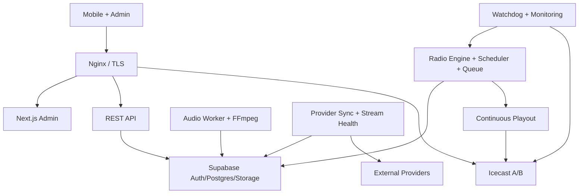

# Deployment Topology & Monorepo Foundation

## 1. Topology النهائية



Control Plane: Next.js, API, Supabase, Worker. Playout Plane: Engine, Scheduler, Queue, playout adapter, Icecast. تعطل Control UI/API لا يسقط playout الحالي.

## 2. توزيع الخدمات

| الخدمة | Development | Staging | Production |
|---|---|---|---|
| Next.js | local process/container | isolated deployment | stateless deployment خلف TLS |
| REST API | local | 1 replica | ≥2 replicas عند الحاجة، bounded pools |
| Supabase | local stack مفضل | مشروع/branch معزول | managed project + backup/PITR |
| Audio Worker/FFmpeg | container غير root | 1 worker | pool قابل للتوسع حسب queue |
| Provider Sync/Health | local bounded worker | isolated queue/pool | connection/resource budget منفصل عن Engine |
| Radio Engine | 1 local instance | active + crash tests | active/standby، leader واحد/station |
| Playout | local adapter | production-like | process معزول لكل station أو isolation مكافئ |
| Icecast | container واحد | instance + fallback test | A/B موصى به؛ single host قبول مخاطر صريح فقط |
| Nginx | local TLS optional | domains staging | public TLS edge؛ internal ports محجوبة |
| Monitoring | logs + local metrics | external probe | external failure domain + alert routing |

المشروع الحالي في `ap-northeast-1`; يفضّل وضع API/Engine/Workers قريبًا أو إثبات latency عبر القياس. لا يعني قرب DB أن Icecast يجب أن يكون في المنطقة نفسها؛ Icecast placement يتبع جمهور المستمعين وegress، بينما Engine يحتاج وصولًا ثابتًا إلى DB/Storage وIcecast.

## 3. Domains and networking

- `api.example.com` → REST API.
- `admin.example.com` → Next.js.
- `radio.example.com/{slug}` → public Icecast mount عبر Nginx.
- `assets.example.com` → public artwork/CDN والـon-demand policy.
- DB، Storage management، Icecast source/admin، metrics endpoints ليست public.
- security groups تسمح Playout→Icecast source وservices→Supabase فقط حسب الحاجة.
- Provider workers فقط تملك outbound access العام مع SSRF/redirect controls؛ External playback direct من Flutter افتراضيًا.

## 4. Deployment units

- Images pinned by digest، non-root، read-only filesystem حيث يمكن، health checks، resource requests/limits.
- Engine state ليس داخل container layer؛ snapshots في DB ومحلي persistent volume للـemergency cache فقط.
- FFmpeg/Liquidsoap إن اعتمد pinned versions وSBOM.
- Nginx streaming routes: proxy buffering off، timeouts طويلة للمستمع، limits مختلفة عن API.
- External streams لا تمر عبر Nginx أو Radio Engine افتراضيًا.

## 5. CI/CD and migrations

1. lint/typecheck/unit/property tests.
2. schema lint + migration reset + RLS/permission tests.
3. build images and dependency/image scan.
4. real integration: Storage fixture → FFmpeg → Engine → Icecast.
5. staging deploy، smoke، fault tests.
6. manual production approval وbackup freshness check.
7. expand migration قبل code؛ contract window؛ destructive cleanup لاحقًا.
8. canary/health/audio probe، ثم rollout.

Rollback image/config سريع. Database changes forward-fix غالبًا؛ rollback SQL لا يفترض أنه آمن. لا تستخدم production للاختبارات اليومية.

## 6. Monorepo structure

```text
Quran-yomk/
├── apps/
│   ├── admin/
│   └── mobile/
├── services/
│   ├── api/
│   ├── audio-worker/
│   ├── radio-engine/
│   ├── playout-adapter/
│   ├── watchdog/
│   ├── metrics-collector/
│   ├── provider-sync/
│   └── stream-health-worker/
├── packages/
│   ├── api-types/
│   ├── domain/
│   ├── config/
│   ├── logging/
│   └── testing/
├── infrastructure/
│   ├── docker/
│   ├── icecast/
│   ├── nginx/
│   ├── monitoring/
│   ├── systemd/
│   └── scripts/
├── supabase/
│   ├── migrations/
│   ├── seed/
│   └── tests/
├── docs/
├── tests/
│   ├── acceptance/
│   ├── reliability/
│   └── fixtures/
└── .github/workflows/
```

لا تنشأ مجلدات فارغة لمجرد الشكل. كل Task في المرحلة التالية ينشئ أقل بنية يحتاجها ويضيف README/test/config لها.

## 7. Backup and disaster recovery

- DB PITR/dump مشفر، object versioning/export، config/schedules backup، secrets في secret manager منفصل.
- quarterly restore إلى staging وفحص DB↔objects وAuth linkage وdefault playlist.
- initial targets المقترحة: DB RPO 15m، object export RPO 24h، control RTO 2h، playout failover RTO 15m؛ تحتاج اعتماد التكلفة.

## 8. Dependencies، مخاطر، Acceptance

- يلزم قرار environment classification للمشروع الحالي وHA budget.
- single Ubuntu host هو SPOF ولو استخدم Docker؛ يقبل محليًا فقط أو كتخفيف مؤقت معلن.
- Acceptance: isolation كامل بين البيئات، no public internal ports، reproducible clean deploy، verified rollback/restore، external probe يرى audio لا HTTP فقط، وتعطل Admin/API لا يسكت المحطة.
- External outage acceptance: لا يستهلك Engine DB pool/CPU/alert budget ولا يغير Internal playout health/fallback.
