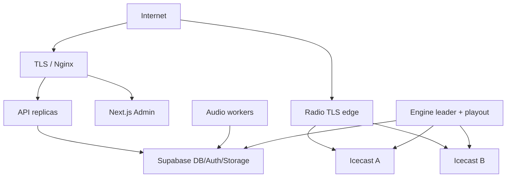

# Authentication, RBAC, Security & Operations

## 1. Authentication

- المستمع بلا حساب في MVP؛ Public API read-only مع rate limiting.
- المشرف عبر Supabase Auth. التوصية email/password + MFA إلزامي لـ`SUPER_ADMIN` و`RADIO_MANAGER` قبل production.
- Next.js يستخدم server-side session/BFF cookies: `HttpOnly`, `Secure`, `SameSite=Lax`, rotation. لا يخزن service role أو secret key في browser.
- كل admin request: validate JWT signature/issuer/audience/expiry ثم administrator active ثم permission.
- حذف/تعطيل مشرف يتضمن revoke sessions؛ حذف Auth user وحده لا يبطل access token فورًا.
- JWT app metadata يمكن أن يساعد UI، لكنه ليس الحقيقة الوحيدة للعمليات الحساسة لأن claims قديمة حتى refresh. API يقرأ/caches DB permissions بTTL قصير ويُبطل cache عند role change.

## 2. RBAC

### Roles

| المجال | SUPER_ADMIN | RADIO_MANAGER | CONTENT_EDITOR | VIEWER |
|---|---:|---:|---:|---:|
| Dashboard/health read | ✓ | ✓ | محدود | ✓ |
| Media/reciters/categories CRUD | ✓ | read/use | ✓ | read |
| Playlist CRUD | ✓ | ✓ | read | read |
| Schedule CRUD/activate | ✓ | ✓ | — | read |
| Radio commands | ✓ | ✓ | — | read status |
| Station settings | ✓ | محدود غير سري | — | read |
| Analytics | ✓ | ✓ | محدود | ✓ |
| Administrators/roles | ✓ | — | — | — |
| Security/config/secrets | ✓ | — | — | — |

التنفيذ permission codes granular مثل `media.create`, `schedule.activate`, `radio.interrupt`, `system.health.read`. Role مجرد bundle. `RADIO_MANAGER` قد يُقيّد بمحطات في Phase 2 عبر `administrator_station_scopes`؛ seam يحجز في authorization service، ولا يلزم MVP table إن كانت محطة واحدة.

### قواعد حساسة

- `radio.interrupt`, `radio.emergency`, role changes وstation stream settings تسجل reason + audit.
- منع آخر SUPER_ADMIN من تعطيل نفسه/إزالة دوره transactionally.
- frontend hiding ليس authorization.
- وظائف `SECURITY DEFINER` إن لزم: في schema غير مكشوف، `search_path=''`, revoke execute from PUBLIC، explicit auth check واختبارات.

## 3. Supabase/PostgreSQL Security

- exposed schema مخصص `api` فقط أو تعطيل Data API إن مر كل الوصول عبر REST service.
- revoke default table/function/sequence privileges؛ grants وRLS في migration نفسها.
- RLS لكل table في schema مكشوف، وdefense-in-depth في `app/radio`.
- views العامة `security_invoker=true` على PostgreSQL 15+ أو تبقى خلف API.
- لا authorization من `user_metadata`؛ role data في DB/`app_metadata` فقط.
- publishable key فقط إن احتاجه browser؛ service/secret keys server-side environment.
- Storage policies exact bucket/prefix; original وprocessed لا public listing.

## 4. Application and Infrastructure Security

- HTTPS everywhere، HSTS بعد التحقق، TLS 1.2+، automated renewal.
- Admin mutation عبر cookie يحتاج CSRF token/origin checks؛ Public bearer APIs لا تعتمد cookie.
- CORS allowlist exact origins؛ لا wildcard مع credentials.
- validation عبر shared JSON Schema، parameterized SQL/query builder، output encoding، CSP، frame-ancestors، nosniff، referrer policy.
- uploads: signature/MIME/probe/limits، random keys، no execute mount، worker non-root، seccomp/resource quotas، FFmpeg pinned and patched.
- Nginx لا يكشف Icecast admin/source endpoints؛ network ACLs وseparate source credentials per station/environment.
- secrets عبر environment/secret manager، rotation runbook، لا logs ولا repo.
- dependency pinning، lockfiles، SBOM/image scan، least-privilege CI identity.
- audit log append-only للتطبيق؛ export دوري إلى وجهة لا يستطيع app تعديل التاريخ فيها مستقبلًا.

## 5. Structured Logging & Metrics

### Log fields

`timestamp, service, level, environment, version, station_id, event, request_id, command_id, media_id, message, error_code, duration_ms`. Redaction مركزي لـauthorization/cookies/passwords/tokens/signed URLs/sensitive headers.

### Metrics

| Area | Metrics |
|---|---|
| Stream | source_connected, mount_reachable, audio_energy, silence_seconds, listeners, peak, reconnects |
| Engine | lease_age, state, transition_failures, queue_depth, fallback_level, checkpoint_age |
| Scheduler | tick_lag, due_count, materialization_errors, conflicts, late/skipped occurrences |
| Commands | pending_age, execution_latency, failed/no-op/duplicate counts |
| Processing | queue age, duration, failure by code, CPU, output/input ratio |
| API | rate, p50/p95/p99 latency, 4xx/5xx, DB pool saturation |
| Host | CPU, memory, disk/inodes, network, clock sync |

### Alerts (initial)

- critical: mount unreachable >15s، audio silence >5s، no leader >15s، emergency cache exhausted، disk >95%.
- high: fallback active >2m، encoder restart، DB unavailable to Engine >5m، command pending high/emergency >10s.
- warning: disk >80%، checkpoint age >15s، processing failure rate >5%، certificate <14 days.
- alert dedup/group by station; escalation and runbook link; maintenance suppression explicit.

القيم Targets أولية وتثبت بالـload/soak tests. SLO مقترح بعد baseline: stream availability 99.9% شهريًا، وNow Playing freshness p95 ≤5s.

## 6. Watchdog & Recovery

ثلاث طبقات:

1. **Process supervisor:** systemd/container restart policy مع exponential delay وstart limits.
2. **Application watchdog:** heartbeats، child decoder/encoder health، queue/lease/DB checks، graceful restart.
3. **External probe:** يجلب public mount ويفك audio frames ويقيس energy/metadata؛ لا يكتفي HTTP 200.

Restart لا يحدث بلا تحقق: detect → collect diagnostic → restart budget → validate source/mount/audio → reconcile lease/state → resume → event/alert. بعد 5 failures/10m يفتح circuit، يبقي emergency path إن يعمل، ويصعّد بدل restart storm.

Public `/health` يعيد status عام فقط. Internal `/admin/api/v1/health/details` يعرض DB/Storage/Engine/Icecast/FFmpeg/queue/scheduler/last success بناءً على permission.

## 7. Backup / Restore / DR

- Supabase PITR/backup حسب الخطة + dump دوري مشفر ومختبر.
- object storage versioning/replication أو export؛ processed قابل لإعادة البناء لكن originals غير قابلة للفقد.
- config/schedules schema + data backup؛ secrets backed up في secret manager منفصل لا في DB dump.
- emergency cache وصور containers قابلة لإعادة البناء من manifests.
- restore drill ربع سنوي إلى staging مع قياس RPO/RTO وفحص: 114 surahs، media/object consistency، schedules، default playlist، Auth linkage.
- أهداف أولية تحتاج اعتماد تكلفة: RPO 15 دقيقة للDB، 24 ساعة للobject export، RTO 2 ساعة control plane و15 دقيقة playout failover.

## 8. Deployment Topology



### Environments

- **development:** Supabase local، Docker Compose لـIcecast/playout/API، sample licensed audio، no public DNS.
- **staging:** منفصل DB/buckets/auth/credentials/domains؛ topology production-like محطة اختبار.
- **production:** managed Supabase، API/Admin منفصلان عن playout host، Icecast A/B موصى به، monitoring external.

المشروع المتاح حاليًا مؤكد في `ap-northeast-1` وPostgreSQL 17. يجب وضع Engine/API/Workers قريبًا شبكيًا من هذه المنطقة أو قياس latency قبل اختيار host، ثم تصنيفه صراحة كـdevelopment أو staging أو production؛ لا تُشارك buckets/credentials بين البيئات.

MVP budget يمكن أن يبدأ بمضيف Ubuntu واحد للEngine+playout+Icecast مع backup host، لكنه SPOF ولا يحقق HA الكامل. يجب توثيق هذا كقبول مخاطر مؤقت لا كتصميم نهائي.

### CI/CD

lint/typecheck/unit → schema lint/RLS tests → build pinned images → integration E2E local Icecast → security scan → staging migration/deploy/smoke → manual production approval → backup check → expand/contract migration → canary/health → rollback image. Database rollback غالبًا forward-fix؛ destructive migrations ممنوعة قبل compatibility window.

## 9. Monorepo Structure

```text
Quran-yomk/
├── README.md
├── apps/
│   ├── admin/                 # Next.js + TypeScript
│   └── mobile/                # Flutter (يبدأ لاحقًا)
├── services/
│   ├── api/                   # Public/Admin REST
│   ├── audio-worker/          # probe/normalize/encode
│   ├── radio-engine/          # state/scheduler/queue/commands
│   ├── playout-adapter/       # continuous source integration
│   ├── metrics-collector/
│   └── watchdog/
├── packages/
│   ├── api-types/             # generated OpenAPI clients/types
│   ├── config/
│   ├── domain/                # pure shared rules
│   ├── logging/
│   └── testing/
├── supabase/
│   ├── migrations/
│   ├── seed/
│   │   └── surahs.sql
│   ├── tests/
│   └── config.toml
├── infrastructure/
│   ├── docker/
│   ├── icecast/
│   ├── nginx/
│   ├── monitoring/
│   ├── systemd/
│   └── scripts/
├── docs/
│   ├── ARCHITECTURE.md
│   ├── DATABASE.md
│   ├── API.md
│   ├── RADIO_ENGINE.md
│   ├── SECURITY.md
│   ├── DEPLOYMENT.md
│   ├── BACKUP_RESTORE.md
│   └── adr/
├── tests/
│   ├── acceptance/
│   ├── reliability/
│   └── fixtures/
└── .github/workflows/
```

لا تُنشأ المجلدات الفارغة في المرحلة الأولى؛ هذه خريطة التنفيذ. كل خدمة لها README وDockerfile واختبارات وحدود config مستقلة عند إنشائها.

## 10. Dependencies / Risks / Acceptance

- يجب اختيار production HA budget/region قبل deployment design النهائي.
- external silence detection قد يعطي false positive في تلاوات هادئة؛ يجمع energy + frames + source heartbeat.
- BFF/session design يحتاج threat-model test وCSRF E2E.
- Acceptance: threat model reviewed، permission matrix كاملة، لا secret/public path leakage، restore runbook قابل للاختبار، watchdog لا يصنع restart storm، وكل بيئة معزولة credentials/data.
